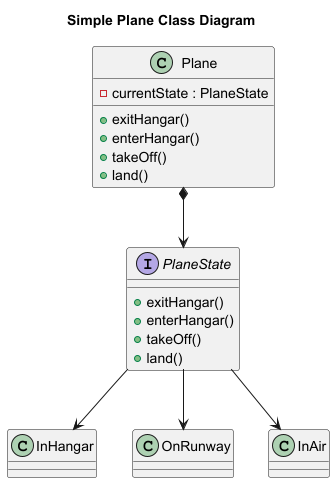
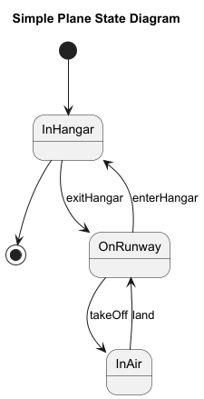
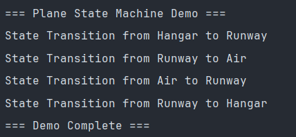
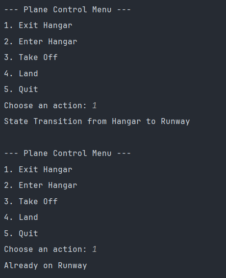
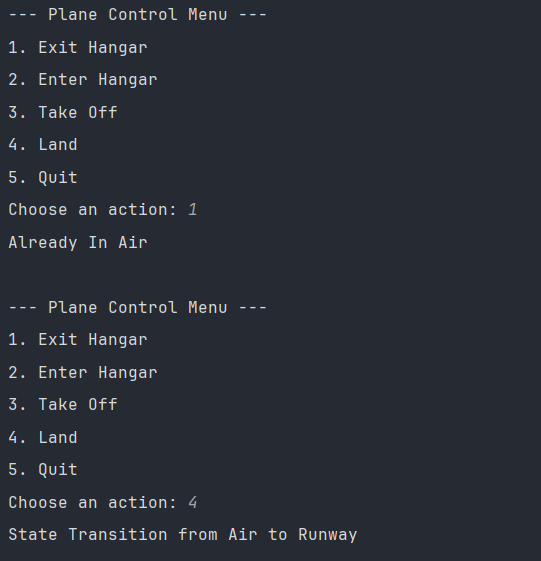

# State Pattern - Plane State Management

This project demonstrates the **State Design Pattern** through a plane state management system where different states (InHangar, OnRunway, InAir) encapsulate specific behaviors and handle state transitions. The pattern allows an object to alter its behavior when its internal state changes, appearing as if the object changed its class.

## Problem

Imagine you're building a plane control system that needs to manage different states and valid transitions. A naive approach might use conditional statements throughout the code:

```java
if (state.equals("InHangar")) {
    if (action.equals("takeOff")) {
        System.out.println("Impossible to take off while in the Hangar");
    } else if (action.equals("exitHangar")) {
        // transition logic
    }
} else if (state.equals("OnRunway")) {
    // more conditionals...
}
```

This approach violates the **Open/Closed Principle** - every time we add a new state or modify transitions, we need to modify existing conditional logic.

## Solution: State Pattern

The State Pattern solves this by:

- Defining a common interface for all state behaviors
- Implementing concrete states that handle transitions and valid operations
- Delegating state-specific behavior to the current state object
- Managing state transitions within the state objects themselves

## Architecture

### System Diagrams

#### Class Diagram (Structure)


The class diagram shows:
- **Plane** (Context): Maintains a reference to the current state object
- **PlaneState** (Interface): Defines the contract for all state implementations
- **Concrete States**: InHangar, OnRunway, InAir implement state-specific behavior

#### State Diagram (Behavior)


The state diagram illustrates:
- **Initial State**: Plane starts in `InHangar` state
- **Valid Transitions**: Clear pathways between states via specific actions
- **Terminal State**: Can terminate from `InHangar` state

### 1. State Interface (PlaneState)

```java
public interface PlaneState {
    void exitHangar();
    void enterHangar();
    void takeOff();
    void land();
}
```

### 2. Concrete States

**InHangar State** - Represents the plane safely stored in hangar
```java
public class InHangar implements PlaneState {
    @Override
    public void exitHangar() {
        System.out.println("State Transition from Hangar to Runway");
        planeState = new OnRunway();
    }
    
    @Override
    public void enterHangar() {
        System.out.println("Already In Hangar");
    }
    
    @Override
    public void takeOff() {
        System.out.println("Impossible to take off while in the Hangar");
    }
    
    @Override
    public void land() {
        System.out.println("Impossible to land while in the Hangar");
    }
}
```

**OnRunway State** - Represents the plane on runway ready for operations
```java
public class OnRunway implements PlaneState {
    @Override
    public void exitHangar() {
        System.out.println("Already on Runway");
    }
    
    @Override
    public void enterHangar() {
        System.out.println("State Transition from Runway to Hangar");
        planeState = new InHangar();
    }
    
    @Override
    public void takeOff() {
        System.out.println("State Transition from Runway to Air");
        planeState = new InAir();
    }
    
    @Override
    public void land() {
        System.out.println("Already on Runway");
    }
}
```

**InAir State** - Represents the plane flying
```java
public class InAir implements PlaneState {
    @Override
    public void exitHangar() {
        System.out.println("Already In Air");
    }
    
    @Override
    public void enterHangar() {
        System.out.println("Impossible to enter the Hangar while In Air");
    }
    
    @Override
    public void takeOff() {
        System.out.println("Already In Air");
    }
    
    @Override
    public void land() {
        System.out.println("State Transition from Air to Runway");
        planeState = new OnRunway();
    }
}
```

### 3. Context Class (Plane)

```java
public class Plane {
    private PlaneState planeState = new InHangar();
    
    // Delegates all operations to current state object
    public void exitHangar() {
        planeState.exitHangar();
    }
    
    public void enterHangar() {
        planeState.enterHangar();
    }
    
    public void takeOff() {
        planeState.takeOff();
    }
    
    public void land() {
        planeState.land();
    }
}
```

### 4. State Transitions

The system follows these valid state transitions as shown in the state diagram:

- **InHangar** → **OnRunway** (via `exitHangar()`)
- **OnRunway** → **InHangar** (via `enterHangar()`)
- **OnRunway** → **InAir** (via `takeOff()`)
- **InAir** → **OnRunway** (via `land()`)

### 5. Client Code Example

```java
public class Main {
    public static void main(String[] args) {
        Plane plane = new Plane();
        
        System.out.println("=== Plane State Machine Demo ===");
        
        // Follows the state diagram transitions
        plane.exitHangar();  // InHangar → OnRunway
        plane.takeOff();     // OnRunway → InAir
        plane.land();        // InAir → OnRunway
        plane.enterHangar(); // OnRunway → InHangar
        
        // Interactive demo allowing user to trigger state transitions
        Scanner scanner = new Scanner(System.in);
        while (true) {
            System.out.println("\n--- Plane Control Menu ---");
            System.out.println("1. Exit Hangar");
            System.out.println("2. Enter Hangar");
            System.out.println("3. Take Off");
            System.out.println("4. Land");
            System.out.println("5. Quit");
            System.out.print("Choose an action: ");
            
            int choice = scanner.nextInt();
            // Menu-driven state transitions based on user input
        }
    }
}
```




## Key Benefits

1. **Eliminates Conditional Logic**: No complex conditionals for state checking
2. **Open/Closed Principle**: Easy to add new states without modifying existing code
3. **Single Responsibility**: Each state class handles its own behavior and transitions
4. **Clean State Transitions**: Transitions are encapsulated within state objects
5. **Maintainable**: State-specific behavior is localized to respective state classes
6. **Clear Visualization**: Class and state diagrams provide comprehensive system understanding

